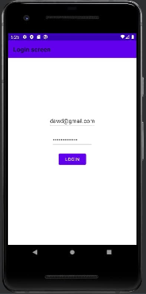
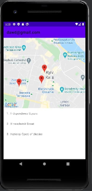

# VertageLabTestApp

This project is done using MVVM architecture and single activity. 

Technologies used: Coroutines, Dagger2 Hilt, LiveData, RecyclerView, Constraint layout, Navigation Components, Google Maps API

 | 
----------- | -------------
login screen | map screen 
